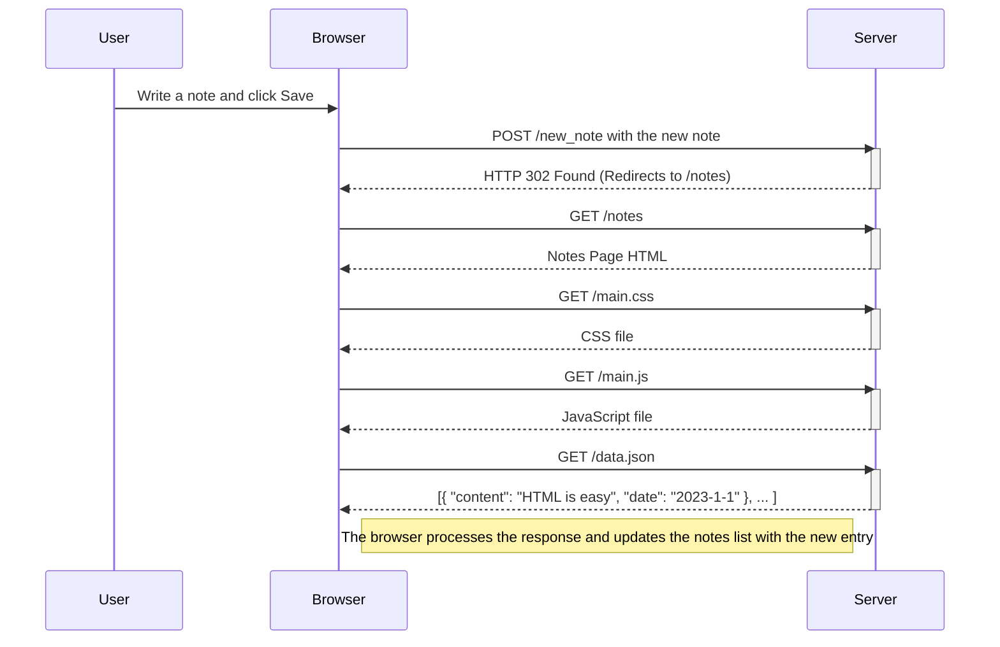

# Diagram of Creating a New Note

```mermaid
sequenceDiagram
 participant User
 participant Browser
 participant Server

 User->>Browser: Write a note and click Save
 Browser->>Server: POST /new_note with the new note
 activate Server
 Server-->>Browser: HTTP 302 Found (Redirects to /notes)
 deactivate Server
 Browser->>Server: GET /notes
 activate Server
 Server-->>Browser: Notes Page HTML
 deactivate Server
 Browser->>Server: GET /main.css
 activate Server
 Server-->>Browser: CSS file
 deactivate Server
 Browser->>Server: GET /main.js
 activate Server
 Server-->>Browser: JavaScript file
 deactivate Server
 Browser->>Server: GET /data.json
 activate Server
 Server-->>Browser: [{ "content": "HTML is easy", "date": "2023-1-1" }, ... ]
 deactivate Server

 Note right of Browser: The browser processes the response and updates the notes list with the new entry
```
